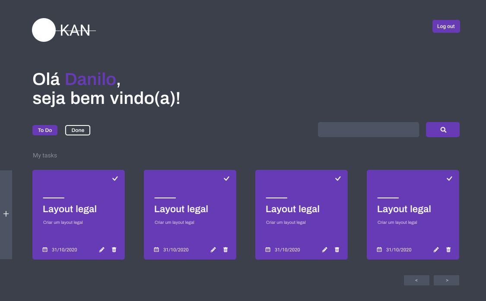

&nbsp;

  

 

&nbsp;

 

  

  

&nbsp;

### Aplicação de gerenciamento de tarefas

&nbsp;

## Tecnologias

- ASP.NET CORE
- HTML5
- CSS3
- JAVASCRIPT
- JQUERY
  

## Rodando o projeto

Para explorar o projeto na sua máquina primeiro certifique-se que você tem o Git e o ASP .NET CORE instalado, se não tiver acesse os links na seção LINKS, para baixar.

1º- Com o git pré-instalado clone o projeto:

~~~shell
git clone https://github.com/DaniloLima122/ip-adress-tracker.git
~~~

2º - Navegue até o a pasta que você clonou no passo anterior e instale as dependencias do projeto, digitando:

~~~shell
dotnet restore
~~~

4º - Abra a pasta que você clonou no seu editor de preferência

5º - Agora é só digitar o comando abaixo e depois digitar a url que irá aparecer no seu terminal na barra de pesquisa do navegador:
~~~shell
dotnet watch run
~~~

## Contribuições

Fique a vontade para avaliar o repositório dando uma "star" ou contribuir com o projeto e reportar sobre bugs e dar sugestões de melhorias.

## Links

- Instalação do [Git](https://git-scm.com/)
- Instalação do [DOT .NET CORE](https://dotnet.microsoft.com/download) 

## Licença
- [MIT](LICENSE)

